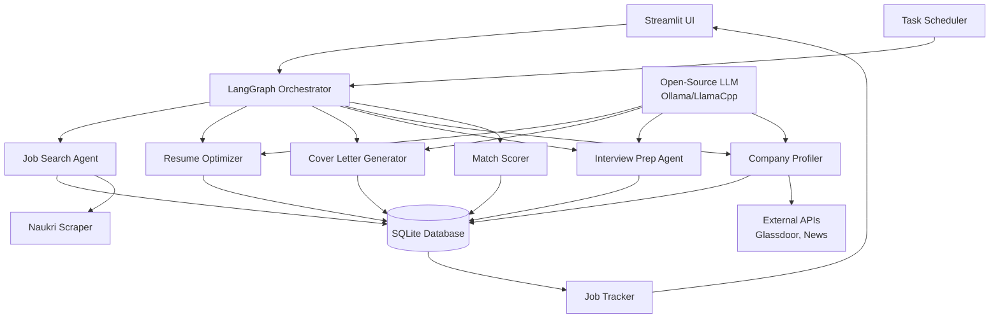

# Design Document

## Overview

The GenAI Job Assistant is a modular, agent-based system built using LangGraph for orchestrating autonomous workflows and Streamlit for the user interface. The architecture follows a plugin-style design where specialized agents handle distinct responsibilities (job search, resume optimization, cover letter generation, interview prep, company profiling). All data is stored locally using SQLite, and the system exclusively uses open-source LLMs to keep costs at zero.

The system operates in two modes:
1. **Autonomous Mode**: Scheduled daily job searches with automatic filtering and notifications
2. **Interactive Mode**: User-driven actions through the Streamlit dashboard for resume optimization, cover letter generation, interview prep, and application tracking

## Architecture

### High-Level Architecture



### Technology Stack

- **Frontend**: Streamlit (web interface)
- **Agent Framework**: LangGraph (multi-agent orchestration)
- **LLM**: Ollama or LlamaCpp with open-source models (Llama 3, Mistral, etc.)
- **Database**: SQLite (local storage)
- **Scraping**: BeautifulSoup4 + Selenium (for Naukri.com)
- **Scheduling**: APScheduler (for daily autonomous runs)
- **Notifications**: 
  - Email via SMTP (smtplib with Gmail/Outlook)
  - WhatsApp via Twilio API (free trial tier)
- **Security**: cryptography library for credential encryption

## Components and Interfaces

### 1. LangGraph Orchestrator

**Responsibility**: Coordinates agent execution, manages workflow state, handles sequential and parallel agent invocation

**Key Methods**:
- `execute_daily_search()`: Triggers autonomous job search workflow
- `optimize_resume(job_id)`: Runs resume optimization for specific job
- `generate_cover_letter(job_id)`: Creates cover letter for job
- `prepare_interview(job_id)`: Generates interview prep materials
- `profile_company(company_name)`: Fetches and analyzes company data

**State Management**: Uses LangGraph's state graph to maintain workflow context, pass data between agents, and handle error recovery

### 2. Job Search Agent

**Responsibility**: Discovers job listings, applies filters, stores results

**Inputs**:
- Search criteria (keywords, salary threshold, location preferences)
- Last search timestamp

**Outputs**:
- List of job listings with metadata
- Count of new jobs found

**Implementation Details**:
- Uses Selenium to navigate Naukri.com (handles dynamic content)
- Applies filters: salary ≥ ₹35L, keywords (GenAI, LLM, LangChain, etc.)
- Extracts: job title, company, salary, description, posting date, URL
- Deduplicates against existing database entries
- Stores raw HTML for future re-parsing if needed

**Interface**:
```python
class JobSearchAgent:
    def search(self, criteria: SearchCriteria) -> List[JobListing]
    def filter_by_keywords(self, listings: List[JobListing]) -> List[JobListing]
    def filter_by_salary(self, listings: List[JobListing], min_salary: int) -> List[JobListing]
    def deduplicate(self, listings: List[JobListing]) -> List[JobListing]
```

### 3. Resume Optimizer

**Responsibility**: Analyzes resume, suggests improvements, generates ATS-optimized versions

**Inputs**:
- User's current resume (text or PDF)
- Target job description (optional)

**Outputs**:
- ATS keyword analysis
- Suggested rewrites for specific sections
- Highlighted improvements for GenAI experience

**Implementation Details**:
- Uses LLM with prompt engineering to analyze resume structure
- Compares resume keywords against job description keywords
- Generates before/after comparisons
- Maintains resume versions in database

**LLM Prompt Strategy**:
- System prompt: "You are an expert resume writer specializing in GenAI and LLM roles"
- User prompt includes: current resume, job description, instruction to identify missing keywords and suggest improvements

**Interface**:
```python
class ResumeOptimizer:
    def analyze_resume(self, resume_text: str) -> ResumeAnalysis
    def optimize_for_job(self, resume_text: str, job_description: str) -> OptimizedResume
    def extract_ats_keywords(self, job_description: str) -> List[str]
    def suggest_improvements(self, resume_text: str, keywords: List[str]) -> List[Suggestion]
```

### 4. Cover Letter Generator

**Responsibility**: Creates personalized cover letters for specific jobs

**Inputs**:
- Job listing details
- User's resume
- User's project portfolio (optional)

**Outputs**:
- Generated cover letter text
- Editable version in UI

**Implementation Details**:
- Uses LLM with structured prompt including job requirements and user background
- Maintains professional tone while personalizing content
- Stores generated letters in database for future reference
- Allows regeneration with different tone/style

**LLM Prompt Strategy**:
- System prompt: "You are a professional cover letter writer"
- User prompt includes: job description, company name, user's relevant experience, specific projects to highlight
- Output format: 3-4 paragraphs, professional tone, specific examples

**Interface**:
```python
class CoverLetterGenerator:
    def generate(self, job: JobListing, resume: str, projects: List[str]) -> str
    def regenerate_with_tone(self, job_id: str, tone: str) -> str
    def save_letter(self, job_id: str, letter: str) -> None
```

### 5. Interview Prep Agent

**Responsibility**: Generates interview questions, conducts mock interviews, provides feedback, manages custom Q&A library

**Inputs**:
- Job description
- User's experience level
- Custom questions from user (optional)

**Outputs**:
- Technical interview questions
- Behavioral interview questions
- Mock interview session
- Answer feedback and improvements
- Ideal answers for custom questions

**Implementation Details**:
- Generates questions based on job requirements using LLM
- Separates technical (coding, system design, GenAI concepts) from behavioral (leadership, teamwork)
- Interactive mock interview mode with follow-up questions
- Analyzes user answers and provides constructive feedback
- Stores custom questions with user answers and LLM-generated ideal answers
- Categorizes questions by: topic (e.g., LangChain, RAG, Fine-tuning), difficulty (easy/medium/hard), type (technical/behavioral)

**LLM Prompt Strategy**:
- Question generation: "Generate 10 technical interview questions for a GenAI role requiring [skills]"
- Answer evaluation: "Evaluate this answer to [question]. Provide feedback on: completeness, accuracy, clarity"
- Ideal answer generation: "Provide an ideal, comprehensive answer to: [custom question]. Consider: technical accuracy, clarity, real-world examples"

**Interface**:
```python
class InterviewPrepAgent:
    def generate_questions(self, job: JobListing, question_type: str) -> List[Question]
    def conduct_mock_interview(self, questions: List[Question]) -> InterviewSession
    def evaluate_answer(self, question: str, user_answer: str) -> Feedback
    def add_custom_question(self, question: str, category: str, difficulty: str) -> None
    def generate_ideal_answer(self, question: str) -> str
    def get_custom_questions(self, filters: Dict) -> List[CustomQuestion]
    def update_custom_question(self, question_id: str, updates: Dict) -> None
```

### 6. Company Profiler

**Responsibility**: Researches companies, generates fit analysis

**Inputs**:
- Company name
- Job listing URL

**Outputs**:
- Company profile (funding, size, rating)
- AI/GenAI focus assessment
- Cultural fit summary

**Implementation Details**:
- Scrapes Glassdoor for ratings and reviews (with rate limiting)
- Searches news APIs for recent company news
- Uses LLM to summarize findings and assess fit
- Caches profiles for 30 days to reduce API calls

**Data Sources**:
- Glassdoor (web scraping with user-agent rotation)
- Google News API (free tier)
- Company website (about page, careers page)

**Interface**:
```python
class CompanyProfiler:
    def profile_company(self, company_name: str) -> CompanyProfile
    def assess_genai_focus(self, company_name: str) -> AIFocusScore
    def get_cached_profile(self, company_name: str) -> Optional[CompanyProfile]
    def summarize_fit(self, profile: CompanyProfile, user_preferences: Dict) -> str
```

### 7. Match Scorer

**Responsibility**: Calculates job-candidate alignment scores

**Inputs**:
- Job listing
- User profile (skills, experience, preferences)

**Outputs**:
- Match score (0-100)
- Score breakdown by factor

**Scoring Algorithm**:
```
Total Score = (Skills Match × 0.35) + (Salary Match × 0.25) + 
              (Tech Stack Match × 0.20) + (Remote Flexibility × 0.10) + 
              (Company Profile × 0.10)

Skills Match: Percentage of required skills user possesses
Salary Match: How close salary is to user's target
Tech Stack Match: Overlap with desired technologies (LangChain, LangGraph, etc.)
Remote Flexibility: Binary score for remote/hybrid options
Company Profile: Based on Glassdoor rating and GenAI focus
```

**Interface**:
```python
class MatchScorer:
    def calculate_score(self, job: JobListing, user_profile: UserProfile) -> MatchScore
    def get_score_breakdown(self, score: MatchScore) -> Dict[str, float]
    def rank_jobs(self, jobs: List[JobListing]) -> List[Tuple[JobListing, MatchScore]]
```

### 8. Job Tracker

**Responsibility**: Manages application history, status, and HR contact information

**Inputs**:
- Job application events (applied, interview, offer, rejection)
- User status updates
- HR contact details (name, email, phone, LinkedIn)

**Outputs**:
- Application timeline
- Statistics dashboard
- Export files (CSV/Excel)
- HR contact directory

**Implementation Details**:
- Tracks state transitions with timestamps
- Supports custom tags and notes
- Stores HR contact information linked to applications
- Generates visualizations (application funnel, timeline)
- Exports to CSV with all metadata including HR contacts
- Provides searchable HR contact directory

**Interface**:
```python
class JobTracker:
    def add_application(self, job_id: str, status: str) -> None
    def update_status(self, application_id: str, new_status: str) -> None
    def mark_as_saved(self, job_id: str) -> None
    def mark_as_not_interested(self, job_id: str) -> None
    def add_hr_contact(self, application_id: str, contact: HRContact) -> None
    def update_hr_contact(self, contact_id: str, updates: Dict) -> None
    def get_hr_contacts(self, filters: Dict) -> List[HRContact]
    def get_statistics(self) -> ApplicationStats
    def export_history(self, format: str) -> str
```

### 9. Notification Manager

**Responsibility**: Sends notifications to user via email and WhatsApp

**Inputs**:
- Notification type (new jobs, interview reminder, status update)
- Notification content
- User preferences (email, WhatsApp number)

**Outputs**:
- Email notifications
- WhatsApp messages (via WhatsApp Business API or Twilio)

**Implementation Details**:
- Uses SMTP for email notifications (Gmail, Outlook)
- Integrates with Twilio API for WhatsApp messages
- Supports notification templates for different event types
- Respects user notification preferences (frequency, channels)
- Batches daily job updates into single digest email
- Sends immediate alerts for interview reminders

**Email Templates**:
- Daily job digest: List of new matching jobs with scores
- Interview reminder: Upcoming interview details with prep materials link
- Application status update: Status change notifications

**WhatsApp Templates**:
- New jobs alert: "Found 5 new GenAI jobs matching your criteria"
- Interview reminder: "Interview with [Company] tomorrow at [Time]"

**Interface**:
```python
class NotificationManager:
    def send_email(self, to: str, subject: str, body: str) -> bool
    def send_whatsapp(self, to: str, message: str) -> bool
    def send_daily_digest(self, jobs: List[JobListing]) -> None
    def send_interview_reminder(self, application: Application) -> None
    def send_status_update(self, application: Application, old_status: str, new_status: str) -> None
    def configure_preferences(self, user_id: str, preferences: NotificationPreferences) -> None
```

### 10. Naukri Scraper

**Responsibility**: Handles Naukri.com-specific scraping logic

**Implementation Details**:
- Uses Selenium WebDriver (headless Chrome)
- Handles login with encrypted credentials
- Navigates search filters programmatically
- Extracts job cards with retry logic
- Respects rate limits (2-second delay between requests)
- Rotates user agents to avoid detection

**Anti-Detection Measures**:
- Random delays between actions
- Realistic mouse movements (Selenium ActionChains)
- Cookie management for session persistence
- Fallback to API endpoints if available

**Interface**:
```python
class NaukriScraper:
    def login(self, credentials: EncryptedCredentials) -> bool
    def search_jobs(self, keywords: List[str], filters: Dict) -> List[RawJobData]
    def extract_job_details(self, job_url: str) -> JobDetails
    def handle_captcha(self) -> bool
```

## Data Models

### JobListing
```python
@dataclass
class JobListing:
    id: str  # UUID
    title: str
    company: str
    salary_min: Optional[int]
    salary_max: Optional[int]
    location: str
    remote_type: str  # "remote", "hybrid", "onsite"
    description: str
    required_skills: List[str]
    posted_date: datetime
    source_url: str
    source: str  # "naukri", "linkedin", etc.
    raw_html: str
    created_at: datetime
    match_score: Optional[float]
```

### UserProfile
```python
@dataclass
class UserProfile:
    id: str
    name: str
    email: str
    resume_text: str
    resume_path: str
    skills: List[str]
    experience_years: int
    target_salary: int
    preferred_locations: List[str]
    preferred_remote: bool
    desired_tech_stack: List[str]
    projects: List[Project]
    created_at: datetime
    updated_at: datetime
```

### Application
```python
@dataclass
class Application:
    id: str
    job_id: str
    user_id: str
    status: str  # "saved", "applied", "interview", "offered", "rejected", "not_interested"
    applied_date: Optional[datetime]
    interview_date: Optional[datetime]
    notes: str
    cover_letter: Optional[str]
    hr_contact_id: Optional[str]
    created_at: datetime
    updated_at: datetime
```

### HRContact
```python
@dataclass
class HRContact:
    id: str
    application_id: str
    name: str
    email: Optional[str]
    phone: Optional[str]
    linkedin_url: Optional[str]
    designation: Optional[str]
    notes: str
    created_at: datetime
    updated_at: datetime
```

### NotificationPreferences
```python
@dataclass
class NotificationPreferences:
    user_id: str
    email_enabled: bool
    email_address: str
    whatsapp_enabled: bool
    whatsapp_number: str
    daily_digest: bool
    interview_reminders: bool
    status_updates: bool
    digest_time: str  # "09:00" format
```

### CustomQuestion
```python
@dataclass
class CustomQuestion:
    id: str
    user_id: str
    question_text: str
    user_answer: Optional[str]
    ideal_answer: Optional[str]
    category: str  # "technical", "behavioral", "system_design", etc.
    topic: str  # "LangChain", "RAG", "Fine-tuning", etc.
    difficulty: str  # "easy", "medium", "hard"
    created_at: datetime
    updated_at: datetime
```

### CompanyProfile
```python
@dataclass
class CompanyProfile:
    id: str
    company_name: str
    glassdoor_rating: Optional[float]
    employee_count: Optional[int]
    funding_stage: Optional[str]
    recent_news: List[str]
    genai_focus_score: float  # 0-10
    culture_summary: str
    cached_at: datetime
    cache_expiry: datetime
```

### MatchScore
```python
@dataclass
class MatchScore:
    job_id: str
    total_score: float  # 0-100
    skills_match: float
    salary_match: float
    tech_stack_match: float
    remote_flexibility: float
    company_profile_score: float
    breakdown: Dict[str, Any]
    calculated_at: datetime
```

## Database Schema

### SQLite Tables

```sql
CREATE TABLE users (
    id TEXT PRIMARY KEY,
    name TEXT NOT NULL,
    email TEXT UNIQUE NOT NULL,
    resume_text TEXT,
    resume_path TEXT,
    skills TEXT,  -- JSON array
    experience_years INTEGER,
    target_salary INTEGER,
    preferred_locations TEXT,  -- JSON array
    preferred_remote BOOLEAN,
    desired_tech_stack TEXT,  -- JSON array
    created_at TIMESTAMP DEFAULT CURRENT_TIMESTAMP,
    updated_at TIMESTAMP DEFAULT CURRENT_TIMESTAMP
);

CREATE TABLE jobs (
    id TEXT PRIMARY KEY,
    title TEXT NOT NULL,
    company TEXT NOT NULL,
    salary_min INTEGER,
    salary_max INTEGER,
    location TEXT,
    remote_type TEXT,
    description TEXT,
    required_skills TEXT,  -- JSON array
    posted_date TIMESTAMP,
    source_url TEXT UNIQUE,
    source TEXT,
    raw_html TEXT,
    created_at TIMESTAMP DEFAULT CURRENT_TIMESTAMP,
    match_score REAL
);

CREATE TABLE applications (
    id TEXT PRIMARY KEY,
    job_id TEXT NOT NULL,
    user_id TEXT NOT NULL,
    status TEXT NOT NULL,
    applied_date TIMESTAMP,
    interview_date TIMESTAMP,
    notes TEXT,
    cover_letter TEXT,
    hr_contact_id TEXT,
    created_at TIMESTAMP DEFAULT CURRENT_TIMESTAMP,
    updated_at TIMESTAMP DEFAULT CURRENT_TIMESTAMP,
    FOREIGN KEY (job_id) REFERENCES jobs(id),
    FOREIGN KEY (user_id) REFERENCES users(id),
    FOREIGN KEY (hr_contact_id) REFERENCES hr_contacts(id)
);

CREATE TABLE hr_contacts (
    id TEXT PRIMARY KEY,
    application_id TEXT NOT NULL,
    name TEXT NOT NULL,
    email TEXT,
    phone TEXT,
    linkedin_url TEXT,
    designation TEXT,
    notes TEXT,
    created_at TIMESTAMP DEFAULT CURRENT_TIMESTAMP,
    updated_at TIMESTAMP DEFAULT CURRENT_TIMESTAMP,
    FOREIGN KEY (application_id) REFERENCES applications(id)
);

CREATE TABLE notification_preferences (
    user_id TEXT PRIMARY KEY,
    email_enabled BOOLEAN DEFAULT TRUE,
    email_address TEXT NOT NULL,
    whatsapp_enabled BOOLEAN DEFAULT FALSE,
    whatsapp_number TEXT,
    daily_digest BOOLEAN DEFAULT TRUE,
    interview_reminders BOOLEAN DEFAULT TRUE,
    status_updates BOOLEAN DEFAULT TRUE,
    digest_time TEXT DEFAULT '09:00',
    FOREIGN KEY (user_id) REFERENCES users(id)
);

CREATE TABLE custom_questions (
    id TEXT PRIMARY KEY,
    user_id TEXT NOT NULL,
    question_text TEXT NOT NULL,
    user_answer TEXT,
    ideal_answer TEXT,
    category TEXT NOT NULL,
    topic TEXT,
    difficulty TEXT,
    created_at TIMESTAMP DEFAULT CURRENT_TIMESTAMP,
    updated_at TIMESTAMP DEFAULT CURRENT_TIMESTAMP,
    FOREIGN KEY (user_id) REFERENCES users(id)
);

CREATE TABLE company_profiles (
    id TEXT PRIMARY KEY,
    company_name TEXT UNIQUE NOT NULL,
    glassdoor_rating REAL,
    employee_count INTEGER,
    funding_stage TEXT,
    recent_news TEXT,  -- JSON array
    genai_focus_score REAL,
    culture_summary TEXT,
    cached_at TIMESTAMP DEFAULT CURRENT_TIMESTAMP,
    cache_expiry TIMESTAMP
);

CREATE TABLE credentials (
    id TEXT PRIMARY KEY,
    service TEXT UNIQUE NOT NULL,  -- "naukri", "linkedin", etc.
    encrypted_data TEXT NOT NULL,
    created_at TIMESTAMP DEFAULT CURRENT_TIMESTAMP,
    updated_at TIMESTAMP DEFAULT CURRENT_TIMESTAMP
);

CREATE INDEX idx_jobs_company ON jobs(company);
CREATE INDEX idx_jobs_posted_date ON jobs(posted_date DESC);
CREATE INDEX idx_jobs_match_score ON jobs(match_score DESC);
CREATE INDEX idx_applications_status ON applications(status);
CREATE INDEX idx_applications_user_id ON applications(user_id);
CREATE INDEX idx_custom_questions_category ON custom_questions(category);
CREATE INDEX idx_custom_questions_topic ON custom_questions(topic);
CREATE INDEX idx_hr_contacts_application_id ON hr_contacts(application_id);
CREATE INDEX idx_hr_contacts_name ON hr_contacts(name);
```

## Error Handling

### Error Categories

1. **Scraping Errors**
   - Network timeouts: Retry with exponential backoff (3 attempts)
   - CAPTCHA detection: Notify user, pause scraping
   - Rate limiting: Implement delay, respect robots.txt
   - Page structure changes: Log error, alert for manual fix

2. **LLM Errors**
   - Model unavailable: Fallback to simpler model or cached responses
   - Generation timeout: Set 30-second timeout, retry once
   - Invalid output format: Use output parsers with retry logic
   - Context length exceeded: Truncate input intelligently

3. **Database Errors**
   - Connection failure: Retry with backoff, create DB if missing
   - Constraint violations: Log and skip duplicate entries
   - Corruption: Maintain daily backups, restore from backup

4. **Authentication Errors**
   - Invalid credentials: Prompt user to re-enter
   - Session expiry: Re-authenticate automatically
   - Encryption failure: Alert user, do not proceed

### Error Recovery Strategy

```python
class ErrorHandler:
    def handle_scraping_error(self, error: Exception) -> RecoveryAction
    def handle_llm_error(self, error: Exception) -> RecoveryAction
    def handle_database_error(self, error: Exception) -> RecoveryAction
    def log_error(self, error: Exception, context: Dict) -> None
    def notify_user(self, error: Exception) -> None
```

### Logging

- Use Python's `logging` module with rotating file handler
- Log levels: DEBUG (development), INFO (production), ERROR (always)
- Log file location: `logs/job_assistant.log`
- Include: timestamp, agent name, action, error details, stack trace

## Testing Strategy

### Unit Tests

**Coverage Areas**:
- Agent logic (search filtering, scoring algorithm)
- Data models (validation, serialization)
- Database operations (CRUD, queries)
- Utility functions (encryption, parsing)

**Framework**: pytest

**Example Tests**:
```python
def test_job_search_agent_filters_by_salary():
    agent = JobSearchAgent()
    jobs = [Job(salary_min=30), Job(salary_min=40)]
    filtered = agent.filter_by_salary(jobs, min_salary=35)
    assert len(filtered) == 1
    assert filtered[0].salary_min == 40

def test_match_scorer_calculates_correctly():
    scorer = MatchScorer()
    job = JobListing(required_skills=["Python", "LangChain"])
    user = UserProfile(skills=["Python", "LangChain", "GenAI"])
    score = scorer.calculate_score(job, user)
    assert 0 <= score.total_score <= 100
    assert score.skills_match == 100.0
```

### Integration Tests

**Coverage Areas**:
- LangGraph workflow execution
- Agent communication and data passing
- Database persistence across agents
- Scraper + database integration

**Example Tests**:
```python
def test_daily_search_workflow():
    orchestrator = LangGraphOrchestrator()
    result = orchestrator.execute_daily_search()
    assert result.jobs_found >= 0
    assert result.jobs_stored == len(db.get_recent_jobs())

def test_resume_optimization_workflow():
    orchestrator = LangGraphOrchestrator()
    result = orchestrator.optimize_resume(job_id="test-job")
    assert result.suggestions is not None
    assert len(result.suggestions) > 0
```

### End-to-End Tests

**Coverage Areas**:
- Complete user workflows (search → apply → track)
- Streamlit UI interactions (using Selenium)
- Scheduled job execution
- Data export functionality

**Example Tests**:
```python
def test_complete_application_workflow():
    # Search for jobs
    jobs = job_search_agent.search(criteria)
    assert len(jobs) > 0
    
    # Optimize resume
    optimized = resume_optimizer.optimize_for_job(jobs[0])
    assert optimized is not None
    
    # Generate cover letter
    letter = cover_letter_generator.generate(jobs[0])
    assert len(letter) > 100
    
    # Track application
    tracker.add_application(jobs[0].id, "applied")
    assert tracker.get_status(jobs[0].id) == "applied"
```

### LLM Testing

**Approach**:
- Use smaller, faster models for testing (e.g., TinyLlama)
- Mock LLM responses for deterministic tests
- Validate output format and structure
- Test prompt engineering with sample inputs

**Example**:
```python
def test_cover_letter_generation_format():
    generator = CoverLetterGenerator(llm=MockLLM())
    letter = generator.generate(sample_job, sample_resume)
    assert letter.startswith("Dear")
    assert "Sincerely" in letter
    assert len(letter.split("\n\n")) >= 3  # At least 3 paragraphs
```

### Manual Testing Checklist

- [ ] Daily search runs at scheduled time
- [ ] Notifications appear for new jobs
- [ ] Resume optimization provides useful suggestions
- [ ] Cover letters are personalized and professional
- [ ] Mock interview mode is interactive and helpful
- [ ] Custom questions are stored and retrieved correctly
- [ ] Ideal answers are generated accurately
- [ ] Company profiles load and display correctly
- [ ] Match scores correlate with job relevance
- [ ] Application tracker updates correctly
- [ ] Export functionality produces valid CSV/Excel
- [ ] Credentials are encrypted and secure
- [ ] UI is responsive and intuitive

## Security Considerations

### Credential Management

- Use `cryptography.fernet` for symmetric encryption
- Store encryption key in environment variable or secure keyring
- Never log or display plain-text credentials
- Implement opt-in consent for credential storage

```python
from cryptography.fernet import Fernet

class CredentialManager:
    def __init__(self, key: bytes):
        self.cipher = Fernet(key)
    
    def encrypt(self, data: str) -> str:
        return self.cipher.encrypt(data.encode()).decode()
    
    def decrypt(self, encrypted_data: str) -> str:
        return self.cipher.decrypt(encrypted_data.encode()).decode()
```

### Data Privacy

- All data stored locally (no cloud uploads)
- User controls data deletion
- No telemetry or analytics collection
- Resume and personal data never sent to external services (except LLM)

### Web Scraping Ethics

- Respect robots.txt
- Implement rate limiting (2-second delays)
- Use official APIs when available
- Rotate user agents responsibly
- Handle CAPTCHAs gracefully (don't bypass aggressively)

## Performance Optimization

### Caching Strategy

- Company profiles: 30-day cache
- Job listings: No cache (always fresh)
- LLM responses: Cache cover letters and interview questions for 7 days
- Database queries: Use indexes for common queries

### Async Operations

- Use `asyncio` for parallel agent execution
- Scrape multiple job pages concurrently (with rate limiting)
- Generate cover letters in background while user browses

### Resource Management

- Limit Selenium instances to 1 concurrent browser
- Close database connections properly
- Implement LLM request queuing to avoid overload
- Use streaming for large LLM responses

## Deployment

### Local Setup

1. Install dependencies: `pip install -r requirements.txt`
2. Install Ollama and pull model: `ollama pull llama3`
3. Initialize database: `python scripts/init_db.py`
4. Configure credentials: `python scripts/setup_credentials.py`
5. Run Streamlit: `streamlit run app.py`

### Scheduled Tasks

- Use APScheduler for daily job search
- Configure cron-like schedule: `cron.schedule("0 9 * * *", execute_daily_search)`
- Ensure script runs even when Streamlit is closed (background service)

### Configuration

- Store config in `config.yaml`:
  - LLM model name
  - Search criteria defaults
  - Notification preferences (email, WhatsApp)
  - User contact details (email: [email], WhatsApp: [phone_number])
  - Scraping delays
  - Database path
  - SMTP settings (server, port, credentials)
  - Twilio settings (account SID, auth token, WhatsApp number)

## Future Enhancements

### Phase 2 Features

1. **Multi-source job search**: LinkedIn, Indeed, AngelList
2. **Chrome extension**: One-click job save from any site
3. **WhatsApp bot**: Get job updates via chat
4. **Learning pathway engine**: Recommend courses based on skill gaps
5. **Analytics dashboard**: Visualize job market trends
6. **Multi-user support**: Add authentication for shared deployments

### Scalability Considerations

- Migrate to PostgreSQL for multi-user scenarios
- Implement Redis for caching
- Use Celery for distributed task execution
- Deploy on cloud (AWS, GCP) with Docker containers
